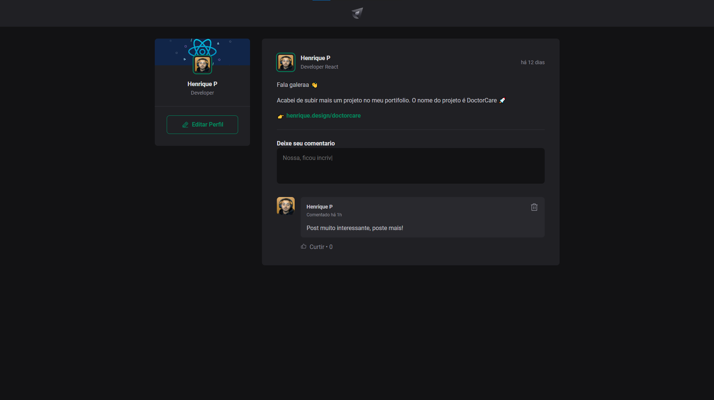

# QuickTweet

<p>
  
  
  
</p>


## Tópicos

[Sobre o Quick Tweet](#sobre-o-Quick-Tweet)

[Tecnologias](#tecnologias)

[Instalação e uso](#instalação-e-uso)

<br>

## Sobre o Quick Tweet

O Quick Tweet é um app simples e demonstrativo, de uma rede social simples, no qual voce pode adicionar posts, comentar nos posts de usuarios, curtir, comentar e remover comentarios feitos por voce.

<br>

<p align="center">
  
</p>

## Tecnologias

Tecnologias e ferramentas utilizadas no desenvolvimento do projeto:

- [React](https://reactjs.org/)
- [TypeScript](https://www.typescriptlang.org/)
- [Date-Fns](https://date-fns.org/)
- [Phosphor-React](https://github.com/axios/axios)
- [Vite](https://vitejs.dev/)

<br>

## Instalação e uso

```bash
# Abra um terminal e copie este repositório com o comando
git clone https://github.com/Zilla3k/QuickTweet.git

# Entre na pasta web com
cd QuickTweet

# Instale as dependências
yarn install ou npm install

# Rode a aplicação
yarn dev ou npm run dev

# Cole o URL no seu navegador
http://localhost:3000/
```

## <br>

Feito com :orange_heart: by [Henrique Pelanda](https://github.com/zilla3k)

[](https://www.linkedin.com/in/henrique-pelanda/)
[](mailto:henriquepelanda.web@gmail.com)
